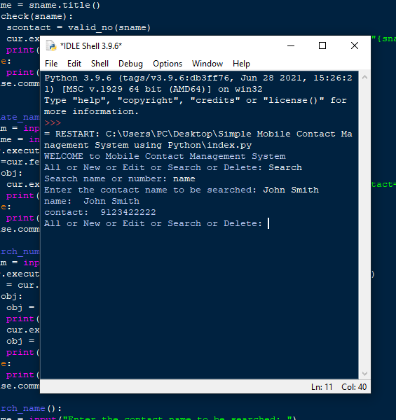

# Simple Mobile Contact Management System using Python 

Simple Mobile Contact Management System with Source Code is a project that can manage your mobile contact list by storing it digitally. The application contains a simple function that enable you to manually enter the mobile number you want to save. The project is a user-friendly kind of system you free to modify it and use it to your own system.

# About the System
The Simple Mobile Contact Management System was built in a console application, the user can accessed the system without any use of user login information. The user can do simple things in the system, he/she can add new Mobile Contact, Remove Current Contact, Search Mobile Contacts. This system can provide you an efficient way for storing the mobile numbers of either your friends, family ,etc. The system will make things easier for you to view the listed mobile number. All the transaction in the system is saves a Database format file extension. The Simple Mobile Contact Management System was created using a basic python coding structure that can be easily understand by all beginners.

# Features
* Basic GUI
* The project contains basic UI such as buttons and textboxes.
* Basic CRUD
* This project contains basic CRUD functions that fundamentally need for building an application.
* User-friendly Interface
* This project was design in a simple user-friendly interface web application so that your easily modified.

# Installation
1. You will have to download & install the Python IDLE's, here's the link "https://www.python.org/downloads/".
2. Extract the zip file.
3. Open the extracted folder
4. Locate the py file.
5. Then open the file via python IDLE.
6. Run the py file to launch the program.
